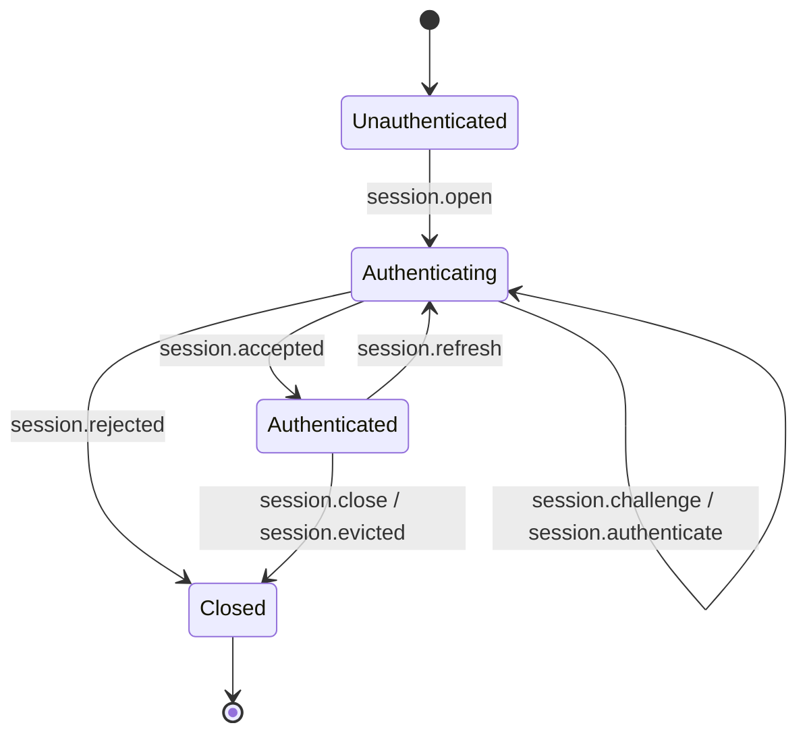
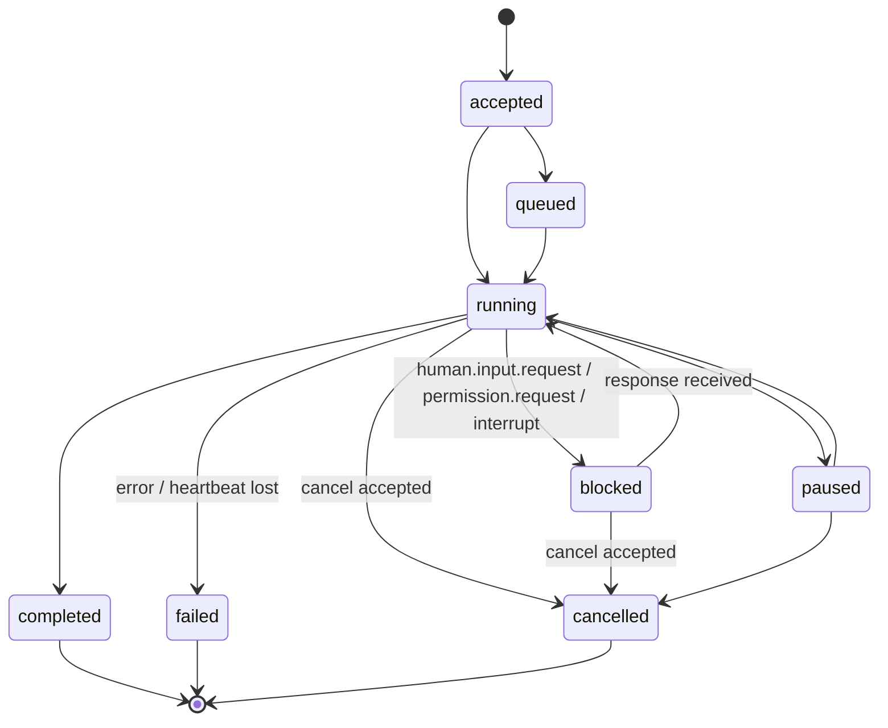
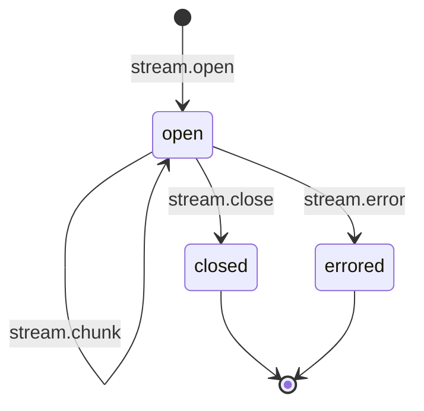
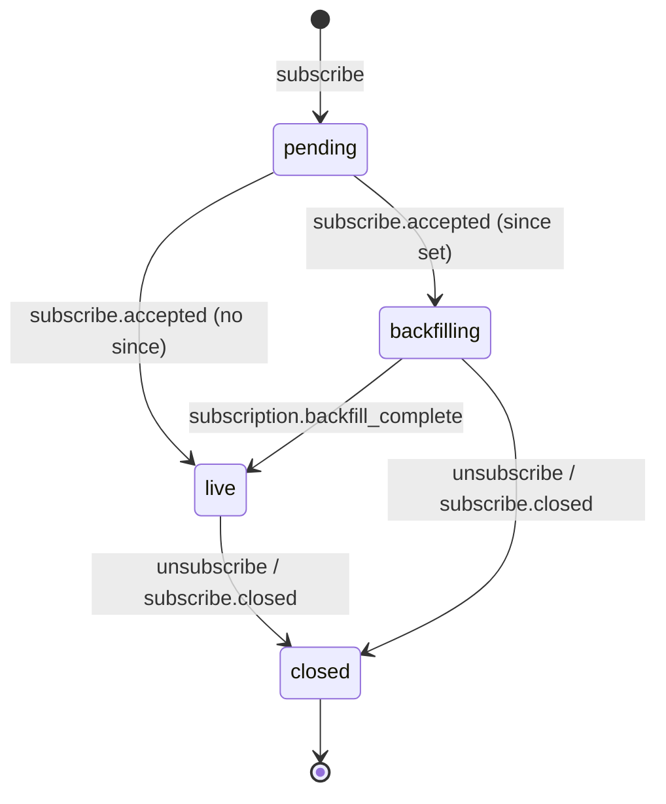
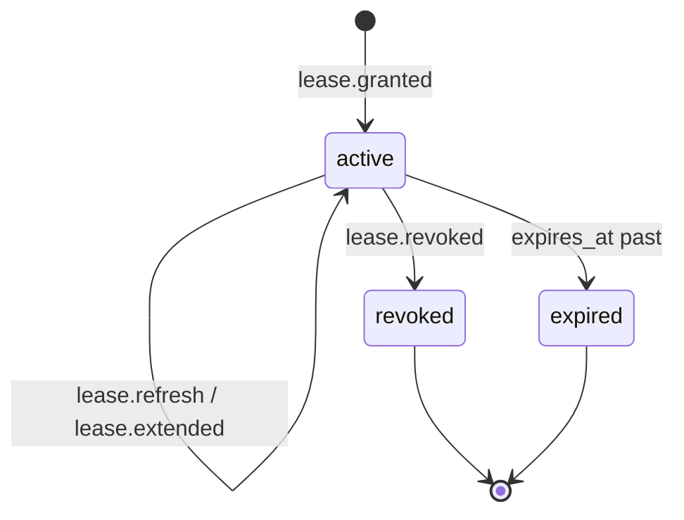

# ARCP C# SDK — Phase 0 Plan

This document captures the v0.1 implementation plan for the ARCP C# SDK
(`ARCP` library + `ARCP.Cli` tool, .NET 10) referenced by RFC-0001-v2 in this
directory. RFC-0001-v2.md is the source of truth; where this plan and the RFC
disagree, the RFC wins. Where the RFC is silent, the choice is documented in
§4 (Open Questions) below.

The plan is organized into:

1. RFC summary (§1)
2. Message-type → namespace/class mapping (§2)
3. State machines (§3)
4. Open questions and chosen interpretations (§4)
5. Test plan (§5)
6. .NET-specific design notes (§6)
7. Dependency rationale (§7)
8. Risks (§8)

---

## 1. RFC Summary by Section

A short note per section about what it means for this implementation. Sections
deferred to v0.2 or beyond are flagged.

- **§1 Goals / §2 Non-Goals / §3 Terminology / §4 Design Principles** —
  Background. Influences class doc XML comments and where the boundaries are
  drawn. Most relevant: §4.6 ("authenticated by default") makes the handshake
  state machine reject all non-handshake messages until `session.accepted`.

- **§5 Architecture** — Three roles (active client / observer / peer runtime).
  Peer-runtime delegation is **deferred** (out-of-scope for v0.1). Observer
  role is implemented through subscriptions in Phase 5.

- **§6.1 Envelope** — Maps to `ARCP.Envelope.Envelope` record + abstract
  `MessageType` payload record. Polymorphic JSON via
  `[JsonPolymorphic(TypeDiscriminatorPropertyName = "type")]`.

- **§6.2 Message Types** — A closed enumeration. Backed by `CoreMessageTypes`
  static array + per-message `[JsonDerivedType]` registrations on `MessageType`.

- **§6.3 Command/Result/Event Flow** — Drives runtime dispatch; reflected in
  `ARCPRuntime.HandleAsync` switch expression.

- **§6.4 Delivery Semantics** — Two idempotency keys. `id` enforced by the
  event log's UNIQUE constraint; `idempotency_key` enforced by a separate
  `(session_principal, idempotency_key)` index on the event log.

- **§6.5 Priority and QoS** — `Priority` enum + scheduling hint in the runtime
  dispatcher and stream channels. Within-stream/within-job ordering preserved.

- **§7 Capability Negotiation** — Handshake; `Capabilities` record; required
  but unsupported → `session.rejected` with `code: UNIMPLEMENTED`.

- **§8 Authentication & Identity** — Four-step handshake with `bearer`,
  `signed_jwt`, `none`. `mtls` and `oauth2` schemas accepted on the wire (so
  we can round-trip messages from peers that advertise them) but rejected at
  runtime with `UNIMPLEMENTED`.

- **§9 Sessions** — Stateless and stateful. **Durable sessions deferred** to
  v0.2 (Phase 5 implements message-id resume; checkpoint resume is deferred).

- **§10.1–10.5 Jobs** — Full state machine + heartbeats + cancellation +
  interrupts. **§10.6 scheduled jobs deferred** — `job.schedule` envelopes
  parse but the handler throws `UnimplementedException`.

- **§11 Streaming** — `text`, `event`, `log`, `thought` kinds full; `binary`
  via base64 only (no sidecar frames). Backpressure via `Channel<T>`.

- **§12 Human-in-the-Loop** — Full. `response_schema` validated via
  `JsonSchema.Net`. First-response-wins (§12.3) only; quorum policies deferred.

- **§13 Subscriptions** — Full. Filter compile-time authorization; backfill +
  live-tail boundary marker; `subscribe.closed` on all termination paths.

- **§14 Multi-Agent** — **Deferred.** `agent.delegate` and `agent.handoff`
  envelopes parse but handlers throw `UnimplementedException`.

- **§15 Permissions & Leases** — Full challenge/response + lease lifecycle.
  **Trust elevation (§15.6) deferred** — recognized as a synthetic permission
  name but no special elevation path beyond ordinary lease handling.

- **§16 Artifacts** — Inline base64 only (`artifact.put` with `data` field).
  Sidecar frames for `artifact.put` deferred. Periodic retention sweep via
  `PeriodicTimer` task supervised by the runtime.

- **§17 Observability** — `log`, `metric`, `trace.span` envelopes. Reserved
  metric names as `public const string` constants. `Microsoft.Extensions.Logging`
  integration. Trace context propagation via `AsyncLocal<TraceContext?>`.

- **§18 Error Model** — `ErrorCode` enum + typed exception hierarchy
  (`ARCPException` and subclasses). `RATE_LIMITED` is exposed as a constant
  alias of `RESOURCE_EXHAUSTED` per §18.2.

- **§19 Resumability** — Message-id resume only. `checkpoint_id` field is
  parsed but ignored; runtime returns `nack` with `UNIMPLEMENTED` if the
  client requests checkpoint resume only.

- **§20 MCP Compatibility** — Documented in `README.md` only; no code.

- **§21 Extensions** — `ExtensionRegistry` + `ExtensionNamespace` validation;
  unknown-message disposition logic per §21.3.

- **§22 Reference Transports** — WebSocket and stdio in v0.1. HTTP/2, QUIC,
  Unix sockets, named pipes, message queues deferred.

- **§23 Example Lifecycle / §24 Example Invocation / §25 Real-World Examples**
  — Drive the sample projects (`samples/01..06`).

- **§26 Future Work / §27 Why ARCP Exists / §28 Reference Motto** — README
  context, no code.

---

## 2. Message Type → Namespace / Class Mapping

Every in-scope message type maps to a sealed record under
`ARCP.Messages.<group>.<Name>` derived from `ARCP.Envelope.MessageType` and
registered with `[JsonDerivedType(typeof(...), "<wire-type>")]`. Out-of-scope
types are still parseable (records exist) but the runtime handler throws
`UnimplementedException`.

| Wire `type`               | Namespace + record                                        | Status |
| ------------------------- | --------------------------------------------------------- | ------ |
| `session.open`            | `ARCP.Messages.Session.SessionOpen`                       | full   |
| `session.challenge`       | `ARCP.Messages.Session.SessionChallenge`                  | full   |
| `session.authenticate`    | `ARCP.Messages.Session.SessionAuthenticate`               | full   |
| `session.accepted`        | `ARCP.Messages.Session.SessionAccepted`                   | full   |
| `session.unauthenticated` | `ARCP.Messages.Session.SessionUnauthenticated`            | full   |
| `session.rejected`        | `ARCP.Messages.Session.SessionRejected`                   | full   |
| `session.refresh`         | `ARCP.Messages.Session.SessionRefresh`                    | full   |
| `session.evicted`         | `ARCP.Messages.Session.SessionEvicted`                    | full   |
| `session.close`           | `ARCP.Messages.Session.SessionClose`                      | full   |
| `ping`                    | `ARCP.Messages.Control.Ping`                              | full   |
| `pong`                    | `ARCP.Messages.Control.Pong`                              | full   |
| `ack`                     | `ARCP.Messages.Control.Ack`                               | full   |
| `nack`                    | `ARCP.Messages.Control.Nack`                              | full   |
| `cancel`                  | `ARCP.Messages.Control.Cancel`                            | full   |
| `cancel.accepted`         | `ARCP.Messages.Control.CancelAccepted`                    | full   |
| `cancel.refused`          | `ARCP.Messages.Control.CancelRefused`                     | full   |
| `interrupt`               | `ARCP.Messages.Control.Interrupt`                         | full   |
| `resume`                  | `ARCP.Messages.Control.Resume`                            | partial (msgid only) |
| `backpressure`            | `ARCP.Messages.Control.Backpressure`                      | full   |
| `checkpoint.create`       | `ARCP.Messages.Control.CheckpointCreate`                  | parse-only |
| `checkpoint.restore`      | `ARCP.Messages.Control.CheckpointRestore`                 | parse-only |
| `tool.invoke`             | `ARCP.Messages.Execution.ToolInvoke`                      | full   |
| `tool.result`             | `ARCP.Messages.Execution.ToolResult`                      | full   |
| `tool.error`              | `ARCP.Messages.Execution.ToolError`                       | full   |
| `job.accepted`            | `ARCP.Messages.Execution.JobAccepted`                     | full   |
| `job.started`             | `ARCP.Messages.Execution.JobStarted`                      | full   |
| `job.progress`            | `ARCP.Messages.Execution.JobProgress`                     | full   |
| `job.heartbeat`           | `ARCP.Messages.Execution.JobHeartbeat`                    | full   |
| `job.checkpoint`          | `ARCP.Messages.Execution.JobCheckpoint`                   | parse-only |
| `job.completed`           | `ARCP.Messages.Execution.JobCompleted`                    | full   |
| `job.failed`              | `ARCP.Messages.Execution.JobFailed`                       | full   |
| `job.cancelled`           | `ARCP.Messages.Execution.JobCancelled`                    | full   |
| `job.schedule`            | `ARCP.Messages.Execution.JobSchedule`                     | parse-only |
| `workflow.start`          | `ARCP.Messages.Execution.WorkflowStart`                   | parse-only |
| `workflow.complete`       | `ARCP.Messages.Execution.WorkflowComplete`                | parse-only |
| `agent.delegate`          | `ARCP.Messages.Execution.AgentDelegate`                   | parse-only |
| `agent.handoff`           | `ARCP.Messages.Execution.AgentHandoff`                    | parse-only |
| `stream.open`             | `ARCP.Messages.Streaming.StreamOpen`                      | full   |
| `stream.chunk`            | `ARCP.Messages.Streaming.StreamChunk`                     | full   |
| `stream.close`            | `ARCP.Messages.Streaming.StreamClose`                     | full   |
| `stream.error`            | `ARCP.Messages.Streaming.StreamError`                     | full   |
| `human.input.request`     | `ARCP.Messages.Human.HumanInputRequest`                   | full   |
| `human.input.response`    | `ARCP.Messages.Human.HumanInputResponse`                  | full   |
| `human.choice.request`    | `ARCP.Messages.Human.HumanChoiceRequest`                  | full   |
| `human.choice.response`   | `ARCP.Messages.Human.HumanChoiceResponse`                 | full   |
| `human.input.cancelled`   | `ARCP.Messages.Human.HumanInputCancelled`                 | full   |
| `permission.request`      | `ARCP.Messages.Permissions.PermissionRequest`             | full   |
| `permission.grant`        | `ARCP.Messages.Permissions.PermissionGrant`               | full   |
| `permission.deny`         | `ARCP.Messages.Permissions.PermissionDeny`                | full   |
| `lease.granted`           | `ARCP.Messages.Permissions.LeaseGranted`                  | full   |
| `lease.refresh`           | `ARCP.Messages.Permissions.LeaseRefresh`                  | full   |
| `lease.extended`          | `ARCP.Messages.Permissions.LeaseExtended`                 | full   |
| `lease.revoked`           | `ARCP.Messages.Permissions.LeaseRevoked`                  | full   |
| `subscribe`               | `ARCP.Messages.Subscriptions.Subscribe`                   | full   |
| `subscribe.accepted`      | `ARCP.Messages.Subscriptions.SubscribeAccepted`           | full   |
| `subscribe.event`         | `ARCP.Messages.Subscriptions.SubscribeEvent`              | full   |
| `unsubscribe`             | `ARCP.Messages.Subscriptions.Unsubscribe`                 | full   |
| `subscribe.closed`        | `ARCP.Messages.Subscriptions.SubscribeClosed`             | full   |
| `artifact.put`            | `ARCP.Messages.Artifacts.ArtifactPut`                     | full (base64 only) |
| `artifact.fetch`          | `ARCP.Messages.Artifacts.ArtifactFetch`                   | full   |
| `artifact.ref`            | `ARCP.Messages.Artifacts.ArtifactRef`                     | full   |
| `artifact.release`        | `ARCP.Messages.Artifacts.ArtifactRelease`                 | full   |
| `event.emit`              | `ARCP.Messages.Telemetry.EventEmit`                       | full   |
| `log`                     | `ARCP.Messages.Telemetry.LogMessage`                      | full   |
| `metric`                  | `ARCP.Messages.Telemetry.Metric`                          | full   |
| `trace.span`              | `ARCP.Messages.Telemetry.TraceSpan`                       | full   |

Status meanings:

- **full** — record + serialization + runtime handler.
- **partial** — record + serialization; some sub-fields ignored (e.g. `Resume.checkpoint_id`).
- **parse-only** — record + serialization; runtime handler throws
  `UnimplementedException` per §18.2 `UNIMPLEMENTED`.

---

## 3. State Machines

### 3.1 Session (§8)



Modeled as a sealed type hierarchy under `ARCP.Runtime.SessionState` with
records `Unauthenticated`, `Authenticating(SessionOpen open)`,
`Authenticated(SessionId id, Capabilities negotiated)`,
`Closed(string reason)`. Handler dispatch matches on the current state.

### 3.2 Job (§10.2)



### 3.3 Stream (§11)



### 3.4 Subscription (§13)



### 3.5 Lease (§15.5)



---

## 4. Open Questions and Chosen Interpretations

### 4.1 Wire shape for `auth` block on `session.open` (§8.2)

The RFC shows `auth: { scheme, token }` and lists `client.fingerprint` for
mTLS. For consistency, our `SessionOpenPayload` carries `auth.scheme: AuthScheme`
(enum) and an optional `auth.token: string?`. `mtls` and `oauth2` are
**accepted into the wire schema** (so we can interoperate with peers that send
them) but the runtime rejects them with `UNIMPLEMENTED`. This matches the
TS reference implementation's approach.

### 4.2 `human.input.request.response_schema` (§12.1)

The example shows JSON Schema syntax. The RFC does not declare a JSON Schema
draft. We use `JsonSchema.Net` and accept any `JsonElement` representing
valid JSON Schema draft 2020-12 (the current default). Invalid responses
trigger `nack` with `code: INVALID_ARGUMENT`. This matches §12.1 "Runtimes
**MUST** validate `value` against `response_schema`".

### 4.3 Heartbeat timing (§10.3)

The RFC defines `heartbeat_interval_seconds` (default 30) but does not define
the exact deadline relationship. Interpretation: each heartbeat carries an
explicit `deadline_ms` (visible in §10.3 example). The runtime considers the
heartbeat lost when `now > last_heartbeat_at + deadline_ms` for two consecutive
heartbeat windows. Default `deadline_ms` = `heartbeat_interval_seconds * 2 *
1000`.

### 4.4 Subscription authorization (§13.2)

§13.2 says "Runtimes **MUST** reject filters that would expose unauthorized
data". Interpretation: the subscriber's `SessionId` (the one that issued the
`subscribe` envelope) must be included in any `filter.session_id` array, OR
the subscriber must hold a `subscribe.cross_session` permission (an
implementation-defined scope). For v0.1, the simpler "must subscribe to your
own session" rule applies; cross-session observation requires a permission.

### 4.5 Artifact URI scheme (§16.1)

The example uses `arcp://session/<sid>/artifact/<aid>`. Treated as opaque by
the protocol; the artifact store generates `arcp://...` URIs but the field is
a `string` (not a `Uri`) on the wire to allow future schemes.

### 4.6 `nack` correlation (§6.3, §18)

`nack` is shown without an explicit `correlation_id` field in §6.2, but §18.1
errors carry `trace_id`. Interpretation: `nack` envelopes carry
`correlation_id` referencing the rejected command's `id` whenever possible;
the field is optional on the wire (matches TS reference). When the rejection
is not in response to a specific command (e.g. mid-handshake protocol error),
`correlation_id` is omitted.

### 4.7 `priority` ordering across streams (§6.5)

§6.5 says "Never reorder messages within a `stream_id` or `job_id`". Within
a single transport, this is straightforward. Across transports (e.g. WebSocket
plus a separate stdio observer), priority is best-effort. Our implementation
uses a single per-transport bounded `Channel<Envelope>` and sorts only within
a fixed-window batch — sufficient for tests, not a guarantee.

### 4.8 `signed_jwt` audience (§8.2)

The RFC says `aud` must equal "the runtime identity". Interpretation: the
`runtime.fingerprint` field from the runtime's identity block is checked
against the JWT `aud` claim. If `runtime.fingerprint` is empty, validation
falls back to `runtime.kind`. Configurable via `JwtAuthOptions.Audience`.

### 4.9 Handshake message envelope `session_id` field

Pre-handshake messages (`session.open`, `session.challenge`,
`session.authenticate`, `session.unauthenticated`, `session.rejected`) have
no `session_id`. Once `session.accepted` is received, all subsequent envelopes
**MUST** include `session_id`. Enforced at the runtime dispatcher.

### 4.10 Concurrency for `idempotency_key`

§6.4 requires a "logical idempotency key" stored per `(session_principal,
idempotency_key)`. Interpretation: `principal` comes from the authenticated
identity (`bearer` token's user, JWT `sub` claim, or `none` → `"anonymous"`).
A UNIQUE constraint on `(principal, idempotency_key)` in the event log
enforces this.

---

## 5. Test Plan

The integration test suite under `tests/ARCP.IntegrationTests/` is organized
by protocol surface. Every test runs against `MemoryTransport` (Phases 2–5)
and is re-parameterized over `WebSocketTransport` and `StdioTransport` in
Phase 6 via `[Theory]` + `[MemberData]`.

### 5.1 Phase 1 — Foundations (`ARCP.UnitTests`)

| Scenario                                    | Surface         |
| ------------------------------------------- | --------------- |
| Envelope round-trip for every message type  | §6.1 / §6.2     |
| Newtype id JSON converters serialize as bare strings | n/a (mech)  |
| Newtype id misuse is a compile error        | n/a (mech)     |
| `ARCPException` chaining via `InnerException` | §18.1        |
| `ErrorCode` ↔ canonical taxonomy            | §18.2          |
| `ExtensionNamespace.IsValid` accepts `arcpx.acme.x.v1` | §21.1 |
| `ExtensionNamespace.IsValid` rejects `x-foo` | §21.1         |
| `ClassifyUnknownType` returns `nack` for core-prefix unknowns | §21.3 |
| `ClassifyUnknownType` returns `drop` for namespaced + `optional` | §21.3 |
| Event log idempotent insert by `(SessionId, MessageId)` | §6.4 |
| Event log dedup by `(principal, idempotency_key)` | §6.4 |
| Event log replay returns canonical order  | §19           |

### 5.2 Phase 2 — Handshake (`HandshakeTests.cs`)

| Scenario                                    | Surface       |
| ------------------------------------------- | ------------- |
| Handshake happy path with `bearer`          | §8.1, §8.2    |
| Handshake happy path with `signed_jwt`      | §8.1, §8.2    |
| Handshake rejected with `none` + no `anonymous` | §8.2      |
| Handshake accepts `none` with `anonymous`   | §8.2          |
| Required-but-unsupported capability → `session.rejected` | §7 |
| Pre-handshake message sent → dropped + logged | §8.1       |
| Replayed `session.open` `id` → `nack`       | §6.4          |
| `mtls` scheme → `session.rejected: UNIMPLEMENTED` | §8.2    |
| `oauth2` scheme → `session.rejected: UNIMPLEMENTED` | §8.2  |
| Mid-handshake disconnect → no leaked state  | §8.1          |
| `session.refresh` triggers re-auth          | §8.4          |
| Failed re-auth → `session.evicted`          | §8.4 / §8.5   |

### 5.3 Phase 3 — Jobs and Streams (`JobLifecycleTests.cs`, `CancellationTests.cs`, `InterruptTests.cs`)

| Scenario                                              | Surface             |
| ----------------------------------------------------- | ------------------- |
| Job lifecycle: accepted → started → progress → completed | §10.1, §10.2     |
| Job failure terminal: `code: INTERNAL`                | §10.2 / §18.1       |
| Heartbeat-lost (2 missed) with `heartbeat_recovery: fail` → `failed: HEARTBEAT_LOST` | §10.3 |
| Heartbeat-lost with `heartbeat_recovery: block` → `blocked` | §10.3       |
| `cancel` accepted → `job.cancelled` within deadline   | §10.4               |
| `cancel` accepted but deadline expired → `code: ABORTED` | §10.4            |
| `cancel` of terminal job → `cancel.refused: already_terminal` | §10.4      |
| `cancel` of unknown job → `cancel.refused: not_found`  | §10.4              |
| `interrupt` → job blocked + `human.input.request` emitted | §10.5           |
| `interrupt` resumed by `human.input.response`         | §10.5               |
| Stream open → chunk → close ordering preserved        | §11                 |
| Stream backpressure (bounded channel) blocks producer | §11.2               |
| `kind: thought` chunk with `redacted: true` carries empty content | §11.4   |
| Unknown stream kind treated as `event`                | §11.1               |

### 5.4 Phase 4 — Human-in-the-Loop and Permissions (`HumanInputTests.cs`, `PermissionLeaseTests.cs`)

| Scenario                                              | Surface             |
| ----------------------------------------------------- | ------------------- |
| `human.input.request` → response within deadline      | §12.1               |
| `human.input.request` invalid response → `nack: INVALID_ARGUMENT` | §12.1   |
| `human.input.request` deadline + default → synthesized response | §12.4    |
| `human.input.request` deadline no default → `human.input.cancelled: DEADLINE_EXCEEDED` | §12.4 |
| `human.choice.request` → response                     | §12.2               |
| First-response-wins across multiple destinations      | §12.3               |
| `permission.request` → grant → lease.granted          | §15.4 / §15.5       |
| Operation with expired lease → `LeaseExpiredError`    | §15.5               |
| Operation with revoked lease → `LeaseRevokedError`    | §15.5               |
| `lease.refresh` → `lease.extended`                    | §15.5               |
| `permission.deny` → job failed                        | §15.4               |

### 5.5 Phase 5 — Subscriptions, Artifacts, Resume (`SubscriptionTests.cs`, `ArtifactTests.cs`, `ResumeTests.cs`)

| Scenario                                              | Surface             |
| ----------------------------------------------------- | ------------------- |
| Subscribe with type filter delivers only matching     | §13.1 / §13.2       |
| Subscribe with `min_priority` filter                  | §13.2               |
| Subscribe with `since.after_message_id` backfills then live | §13.3         |
| `subscription.backfill_complete` boundary marker emitted | §13.3            |
| Subscribe to other session w/o permission → `PERMISSION_DENIED` | §13.2     |
| `unsubscribe` closes subscription                     | §13.4               |
| `subscribe.closed` on session evict                   | §13.4               |
| Artifact put → fetch round-trip                       | §16.2               |
| Artifact fetch after release → `NOT_FOUND`            | §16.3               |
| Artifact retention sweep removes expired              | §16.3               |
| Resume with `after_message_id` replays then live tails | §19                |
| Resume after retention expiry → `code: DATA_LOSS`     | §19                 |

### 5.6 Phase 6 — Transports

Re-parameterize selected scenarios (handshake happy path, full job lifecycle,
human input round-trip, subscription backfill+live) over both
`WebSocketTransport` and `StdioTransport` via `[Theory]`.

### 5.7 Phase 7 — End-to-End Scenarios (`E2E/RelayScenarioTests.cs`)

A single full scenario per §25 / `agent-relay-human-input.jsonl`:
runtime + agent client + observer subscriber. Agent invokes a tool, requests
human input which the observer answers, agent produces an artifact, completes.
Same scenario runs against WebSocket and stdio.

---

## 6. .NET-Specific Design Notes

These choices are explicit because they're load-bearing and would surprise
someone reading the code without context. They are summarized in the prompt;
restated here for record.

- **Polymorphic `[JsonDerivedType]` for envelope dispatch.** `MessageType` is
  an `abstract record` decorated with one
  `[JsonDerivedType(typeof(Foo), "wire-name")]` per concrete payload. The
  envelope's `Payload` property is typed `MessageType` and System.Text.Json's
  built-in polymorphic serializer reads/writes the `"type"` discriminator
  inside the envelope object. This keeps envelope dispatch a single switch
  expression with pattern matching, with the C# compiler enforcing
  exhaustiveness via the `IDE0010` analyzer.

  **Trade-off:** System.Text.Json reads `type` from the envelope itself, not
  from a nested object. The wire format puts `type` at the envelope level
  (correct per §6.1), so the polymorphism is **not** on a nested
  `payload` object — it's on the envelope, with payload fields hoisted
  alongside envelope fields. We work around this by using a custom
  `EnvelopeJsonConverter` that two-passes the JSON: first reading `type`,
  then deserializing the rest of the document into the right derived record
  with `payload` as a sub-object.

- **`readonly record struct` IDs with custom `JsonConverter`.** Each id type
  (`SessionId`, `MessageId`, `JobId`, etc.) is a value type with one `Value`
  property. A custom `JsonConverter<T>` serializes/deserializes the bare
  string. Strong typing prevents `MessageId` from being passed where
  `SessionId` is expected. Implicit `string` conversion is **not** added —
  callers go through `.Value` or `.ToString()` explicitly.

- **`IAsyncEnumerable<T>` for streams + subscriptions.** `await foreach`
  consumer ergonomics are excellent. `[EnumeratorCancellation]` parameter
  threading.

- **`Channel<T>` with `BoundedChannelFullMode.Wait` for backpressure.**
  Producer-side `WriteAsync` blocks naturally; we surface a `backpressure`
  envelope when the fill ratio crosses a threshold so the *peer* can throttle.

- **`TaskCompletionSource<T>` with `RunContinuationsAsynchronously`.** Always.
  Without the flag, completion runs continuations on the completer's thread,
  causing latency spikes in protocol code.

- **`AsyncLocal<TraceContext?>` for trace context.** Flows automatically
  across `await` boundaries. Re-established on each inbound envelope receive.

- **`TimeProvider`.** Constructor-injected into `JobManager`,
  `LeaseManager`, `ArtifactStore`. `TimeProvider.System` in production,
  `Microsoft.Extensions.TimeProvider.Testing.FakeTimeProvider` in tests.

- **`Microsoft.Extensions.Logging.ILogger<T>`.** Constructor-injected. No
  static loggers, no service locators, no `Console.WriteLine` in library
  code. The CLI sub-project uses `Console` for user-facing output only.

- **No `static` mutable state.** Every test instantiates a fresh `ARCPRuntime`
  with its own `EventLog`, ports, and `TimeProvider`.

- **Newlines + `System.Text.Json` for stdio framing.** `JsonSerializer.Serialize`
  followed by `\n`. Reader uses `StreamReader.ReadLineAsync(ct)` and
  `JsonSerializer.Deserialize`.

- **WebSocket server via `<FrameworkReference Include="Microsoft.AspNetCore.App" />`.**
  Documented cost: consumers of `ARCP` pull in the ASP.NET Core framework
  reference even if they only use the client. Acceptable for v0.1; we may
  split into `ARCP.Server.WebSocket` in v0.2 if the surface grows.

- **`required` modifier for required envelope fields.** Turns "I forgot to
  set `Id`" into a compile error.

- **`UnimplementedException` carries an RFC `section` string.** Every throw
  site quotes the section number so users see exactly what's missing.

---

## 7. Dependency Rationale

Centrally managed via `Directory.Packages.props`. Deviations require updating
this section.

**Runtime (`src/ARCP`):**

- `Microsoft.Data.Sqlite` — official Microsoft ADO.NET provider for SQLite.
  No native dep installation thanks to `SQLitePCLRaw.bundle_e_sqlite3`.
- `Microsoft.Extensions.Logging.Abstractions` — facade only. No backend.
- `Microsoft.IdentityModel.JsonWebTokens` — JWT validation for
  `signed_jwt` auth (§8.2).
- `Ulid` (Cysharp) — sortable, fast 128-bit IDs. Used for envelope `id`,
  session ids, etc.
- `JsonSchema.Net` — JSON Schema draft 2020-12 for §12.1 validation.

**CLI (`src/ARCP.Cli`):**

- `System.CommandLine` — Microsoft's CLI parsing library.

**Test (`tests/*`):**

- `Microsoft.NET.Test.Sdk`, `xunit`, `xunit.runner.visualstudio` — standard.
- `FluentAssertions` — readability.
- `coverlet.collector` — coverage.
- `Microsoft.Extensions.Logging.Console` — test-time backend for
  `ILogger<T>`.
- `Microsoft.Extensions.TimeProvider.Testing` — `FakeTimeProvider` for
  deterministic time in tests.

**Build:**

- `Microsoft.CodeAnalysis.NetAnalyzers` — implicit in modern SDK.
- `StyleCop.Analyzers` — style enforcement.

**Explicitly not added:** `Newtonsoft.Json`, `AutoMapper`, `MediatR`, `Serilog`,
`NLog`, `Polly`, Reactive Extensions, any IoC container.

---

## 8. Risks and Blockers

### 8.1 .NET 10 SDK availability (BLOCKER, 2026-05-09)

At the time of writing, the local development machine has **no `dotnet`
binary in PATH and no .NET SDK installed**. .NET 10 LTS (released
November 2025) is the prompt's target framework. Without an SDK, no phase
gate command (`dotnet format`, `dotnet build`, `dotnet test`, `dotnet pack`)
can be executed, which is a required precondition for every gate to pass.

This needs to be resolved before Phase 1 begins. Two installation paths:

1. **Microsoft `dotnet-install.sh`** (official, side-installs into
   `~/.dotnet`, reversible by deleting the directory):
   ```sh
   curl -sSL https://dot.net/v1/dotnet-install.sh | bash -s -- --channel 10.0
   export PATH="$HOME/.dotnet:$PATH"
   ```
2. **Homebrew cask** (`brew install --cask dotnet-sdk`): system-wide via
   `/usr/local/share/dotnet`, requires `sudo`. As of this writing the
   `dotnet-sdk` cask tracks the latest stable, which should be 10.0.x.

The decision is the user's; PLAN.md documents it once made. Until then,
phase gate commands cannot be executed and the project cannot proceed past
Phase 0.

### 8.2 ASP.NET Core framework reference for WebSocket server

Using `<FrameworkReference Include="Microsoft.AspNetCore.App" />` gives
consumers a ~30 MB payload they may not want. v0.1 ships it inside the main
`ARCP` package; v0.2 should split out `ARCP.Server.WebSocket` so client-only
consumers can avoid the framework cost. Documented in `README.md`.

### 8.3 `JsonSchema.Net` validation correctness

JSON Schema is an imperfect spec with multiple drafts. `JsonSchema.Net`
defaults to draft 2020-12. We restrict the valid `response_schema` set to
draft 2020-12 (no `$schema` ⇒ default; explicit `$schema` of an older draft
⇒ rejected). Documented in §4.2.

### 8.4 Cross-platform timing assumptions in tests

Tests using `FakeTimeProvider` are deterministic. Tests using real timers
(e.g. transports' reconnect backoff) use generous tolerances (≥100ms) to
avoid CI flake on slow runners. No real-time scheduling is exercised in the
gate suite.

### 8.5 Source-generated serializer contexts

Deferred to v0.2. v0.1 uses reflection-based `System.Text.Json` for both
read and write. Performance is adequate (handshake + a few thousand
envelopes per integration test runs in well under a second on the
reference machine). AOT-compatibility is therefore best-effort.

---

## 9. Phase Order Recap

1. **Phase 0** — RFC, plan, skeleton, gate baseline. _(this document)_
2. **Phase 1** — Envelope, ids, errors, extensions, event log.
3. **Phase 2** — Messages, handshake, capability negotiation.
4. **Phase 3** — Jobs, streams, cancellation, interrupts.
5. **Phase 4** — Human input, permissions, leases.
6. **Phase 5** — Subscriptions, artifacts, resume.
7. **Phase 6** — Transports (WebSocket, stdio).
8. **Phase 7** — CLI, samples, docs, packaging, tag `v0.1.0`.

Each phase has a hard gate (`dotnet format --verify-no-changes`,
`dotnet build -c Release --warnaserror`,
`dotnet test -c Release`,
`dotnet pack -c Release --output ./artifacts --no-build`). All four must exit
0 before the next phase begins.
