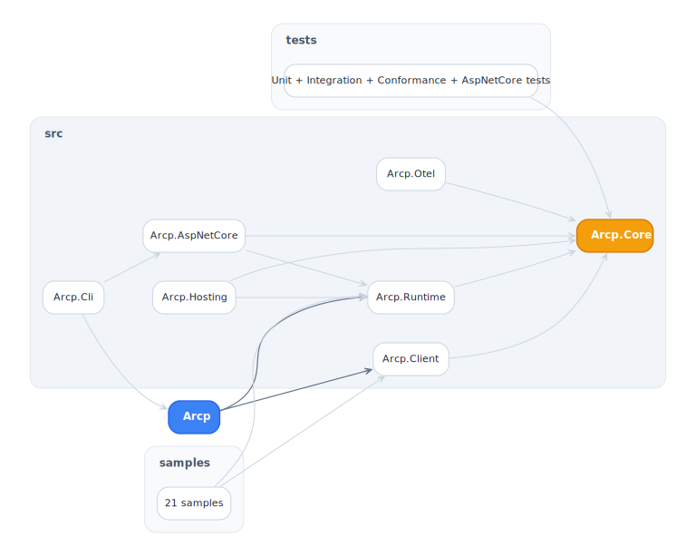
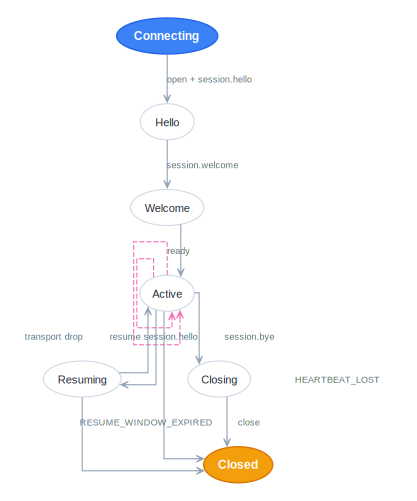
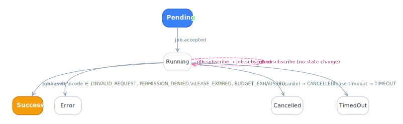
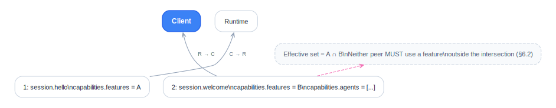
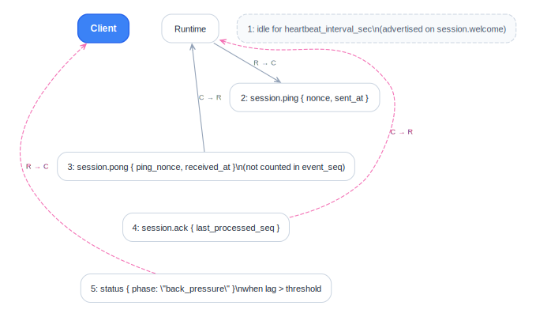
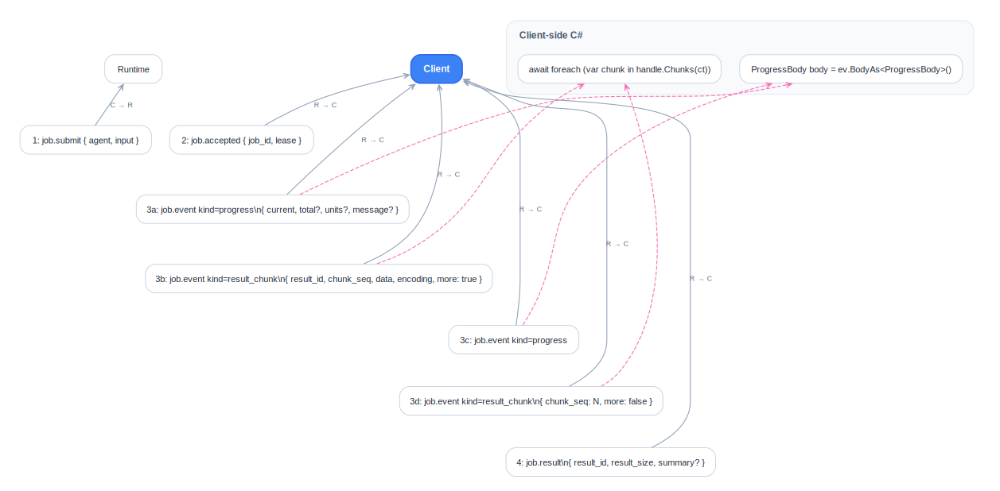

# Diagrams

Paired light/dark Graphviz diagrams for the ARCP C# SDK. Edit the `.dot` sources; render with `dot -Tsvg`.

## Project graph

<picture>
  <source media="(prefers-color-scheme: dark)" srcset="arcp-projects-dark.svg">
  
</picture>

## Session FSM

<picture>
  <source media="(prefers-color-scheme: dark)" srcset="session-fsm-dark.svg">
  
</picture>

## Job FSM

<picture>
  <source media="(prefers-color-scheme: dark)" srcset="job-fsm-dark.svg">
  
</picture>

## Capability negotiation

<picture>
  <source media="(prefers-color-scheme: dark)" srcset="capability-negotiation-dark.svg">
  
</picture>

## Heartbeat + ack

<picture>
  <source media="(prefers-color-scheme: dark)" srcset="heartbeat-ack-dark.svg">
  
</picture>

## Result chunks + progress

<picture>
  <source media="(prefers-color-scheme: dark)" srcset="result-chunk-progress-dark.svg">
  
</picture>

## Render

```sh
cd docs/diagrams
for f in *.dot; do dot -Tsvg "$f" -o "${f%.dot}.svg"; done
```

`graphviz` provides `dot`. On macOS: `brew install graphviz`. On Debian/Ubuntu: `apt-get install -y graphviz`.
